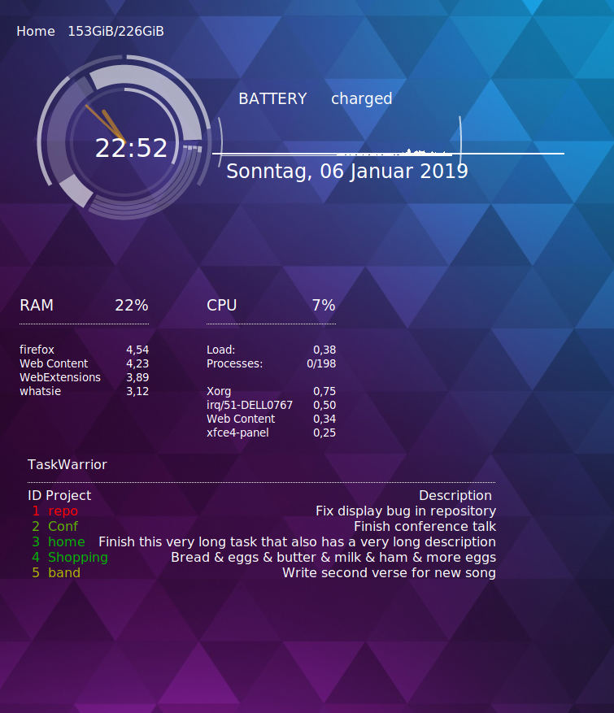

# Conky Rings Revamped

The whole setup is based on Conky theme by YesThisIsMe, modified a lot by [trollpunny](https://www.deviantart.com/trollpunny/art/Conky-Rings-Revamped-591137228).

There are four separate Conky widgets in the whole setup:
1. the main one with rings
2. memory
3. CPU
4. notes (lists the contents of tasks saved using the commandline tool task)

Use the `startconky.sh` script to start them in proper order.

Put all the files in `~/.Conky/` and run the script to start them. You can autostart the script at startup to make it
load at every boot.

Example image:

